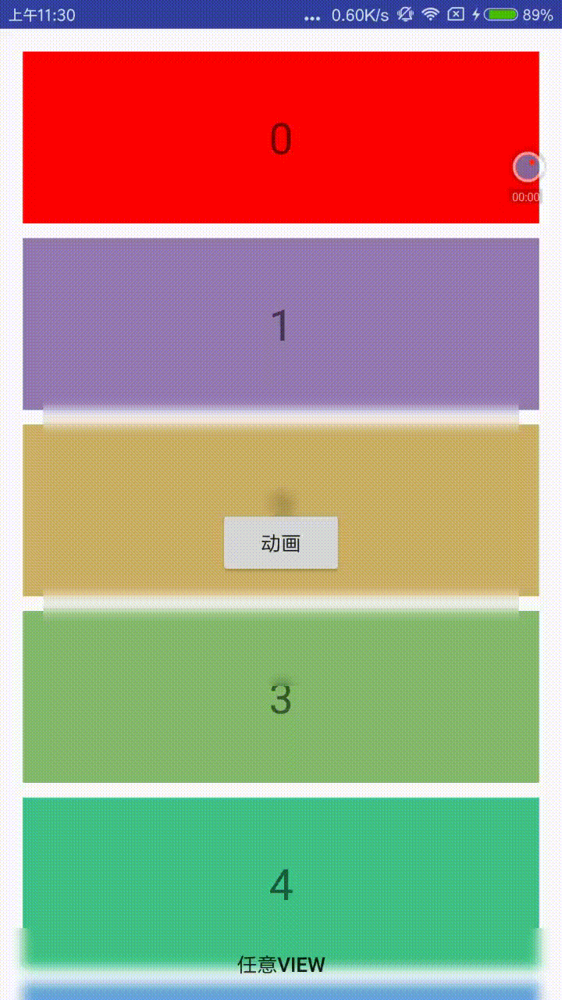

## HokoBlurDrawable


HokoBlurDrawable is an Android component which provides dynamic blur effect.


### 1. Introductions

- Function：

	**Dynamic blur, real-time blurring of the background**。

- Features：
	- Multiple algorithms: Box、Stack and Gaussian algorithms. Provide different blur effect；
	- 🚀iOS-like dynamic backgroud blur: Compared to using RenderScript to process bitmaps, the component has better performance and effect.

### 2. Dynamic background blur

Dynamic Blur provides real-time background blurring of View and ViewGroup, not for Bitmap implementations. The component will blur the area where the View is located.

To add background blur to the View, just set the BlurDrawable to the View background.

```java
final BlurDrawable blurDrawable = new BlurDrawable();
View view = findViewById(R.id.test_view);
view.setBackgroundDrawable(blurDrawable);

```
Change the blur parameters：

```java
blurDrawable.mode(mode)
blurDrawable.radius(radius)
blurDrawable.sampleFactor(factor)

```

Add blur color mixture(OverlayColor)

```java
blurDrawable.mixColor(color)
blurDrawable.mixPercent(percent) //0 ~ 1.0
```

DISABLE/ENABLE background blur

```java
blurDrawable.disableBlur();
blurDrawable.enableBlur();
```
HokoBlur already contains three common ViewGroups that implement background blur, including BlurFrameLayout, BlurLinearLayout, and BlurRelativeLayout.


```java
// blur animation
ValueAnimator animator = ValueAnimator.ofInt(0, 20);
animator.setDuration(2000);
animator.addUpdateListener(new ValueAnimator.AnimatorUpdateListener() {
    @Override
    public void onAnimationUpdate(ValueAnimator animation) {
        mFrameLayout.getBlurDrawable().setBlurRadius((Integer) animation.getAnimatedValue());
    }
});

```





### 3. Proguard
In order to make Hoko blur work normally, you need to add the following rules when using proguard:

```java
-keep class com.hoko.blur.opengl.functor.** { *; }

```


## 动态模糊组件HokoBlur


### 1. 描述

- 组件主要提供以下功能：

	**动态模糊，对背景的实时模糊**。

- 组件主要的特性：
	- 多种算法，包括Box、Stack和Gaussian算法，满足不同的模糊效果；
	- 🚀类似iOS的动态背景模糊，相比使用RenderScript处理Bitmap的动态模糊方案，具有更好的效果和性能
	

### 2. 动态模糊

动态模糊提供了对View以及ViewGroup的实时背景模糊，并不是针对Bitmap的实现。组件将会对View所在区域进行模糊。

为View添加背景模糊，只需要将BlurDrawable设置为View背景即可。

```java
final BlurDrawable blurDrawable = new BlurDrawable();
View view = findViewById(R.id.test_view);
view.setBackgroundDrawable(blurDrawable);

```
模糊参数的调整，可以这样操作：

```java
blurDrawable.mode(mode)
blurDrawable.radius(radius)
blurDrawable.sampleFactor(factor)

```

为模糊效果添加混合蒙版(OverlayColor)

```java
blurDrawable.mixColor(color)
blurDrawable.mixPercent(percent) //0 ~ 1.0
```

禁用/开启背景模糊

```java
blurDrawable.disableBlur();
blurDrawable.enableBlur();
```
组件已包含实现背景模糊的三种常用ViewGroup，包括BlurFrameLayout、BlurLinearLayout和BlurRelativeLayout。

使用示例：

```java
// 模糊动画
ValueAnimator animator = ValueAnimator.ofInt(0, 20);
animator.setDuration(2000);
animator.addUpdateListener(new ValueAnimator.AnimatorUpdateListener() {
    @Override
    public void onAnimationUpdate(ValueAnimator animation) {
        mFrameLayout.getBlurDrawable().setBlurRadius((Integer) animation.getAnimatedValue());
    }
});

```
gif图较大，稍等片刻


### 3. 配置
动态模糊正常工作，需要在混淆时加入下面的规则：

```java
-keep class com.hoko.blur.opengl.functor.** { *; }

```

